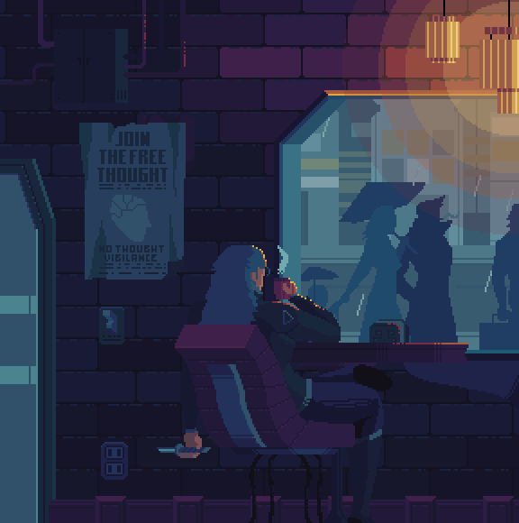
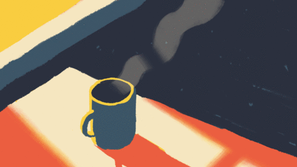

  

<h1 align="center">
  
</h1>

  

  

<table align="center" style="width:100%; text-align: left;">
  <tr>
    <td width="55%" style="vertical-align: top;">
      <h2>👨‍💻 Sobre Mim</h2>
          
 Sou um desenvolvedor <b>Back-end em formação</b>, com foco em <b>Java</b>. Atualmente, divido meu tempo entre o trabalho, a faculdade e o estudo de <b>motores gráficos</b> e <b> Inteligência Artificial</b>. 

      <ul>
        <li> Aprofundando estudos em <b>NestJS</b> e escalabilidade de APIs.</li>
        <li>🤖 Atualmente construindo um <b>Assistente de Code Review com IA</b>.</li>
        <li>🎮 Apaixonado por <b>Game Design</b> e desenvolvimento em <b>Unity/Unreal Engine</b>.</li>
      </ul>
      
 <h2>🛠️ Tech Inventory (Skills)</h2>

### 🌐 Back-end & Languages

  

### 🎮 Game Development & Tools

  

    </td>
    
   <td width="45%" style="vertical-align: top;">
      <h2>🎯 Objetivos Atuais:</h2>
      
Melhorar minhas práticas com motores gráficos e estudo sobre Level e Game Designs e como minha maior meta: <b>Poder aprender uma linguagem por período durante a minha faculdade.</b>

      
   <h2>🎲 Além do Código</h2>
      
Quando não estou programando, estou explorando outros mundos:

      <ul>
        <li><b>TTRPGs:</b> D&D 5.5e, Daggerheart, Call of Cthulhu, Mothership. <b>Jogador</b>.</li>
        <li><b>Gaming:</b> <a href=https://steamcommunity.com/profiles/76561198276721315/>+250 jogos na biblioteca Steam</a>.</li>
        <li><b>Books:</b> <a>Lendo Livros de Investigação ou algo mais sobrenatural</a>.</li>
      </ul>
    </td>
  </tr>
</table>

###

  
  

###

 

  

###

<h2 align="center">📬 Vamos Conectar?</h2>

  
  
  
  
  

<h3 align="center">💬 Citação Randômica de Desenvolvimento</h3>
<blockquote align="center">
  

</blockquote>

 

  

